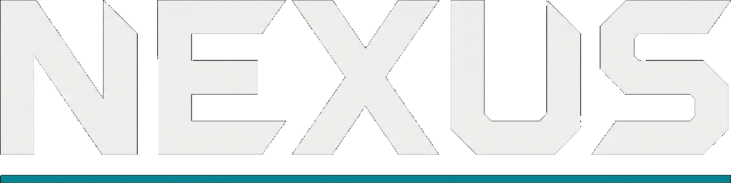

<p align="center">
  
</p>

<p align="center">
  <em>One prompt. Many agents. One deliverable. Running on your laptop.</em>
</p>

<p align="center">
  <a href="https://nexus-web-snowy.vercel.app/">Live Demo</a> &middot;
  <a href="#quick-start">Quick Start</a> &middot;
  <a href="#core-features">Features</a> &middot;
  <a href="#architecture">Architecture</a> &middot;
  <a href="#roadmap">Roadmap</a>
</p>

<p align="center">
  <a href="https://nodejs.org/"></a>
  <a href="https://www.typescriptlang.org/"></a>
  <a href="./LICENSE"></a>
</p>

---

## Table of Contents

- [What is Nexus](#what-is-nexus)
- [Why I Built This](#why-i-built-this)
- [Live Demo](#live-demo)
- [Core Features](#core-features)
  - [Skills & Tools](#skills--tools)
  - [Sub-Agents](#sub-agents)
  - [Sandbox & File System](#sandbox--file-system)
  - [Provider-Agnostic Models](#provider-agnostic-models)
- [Quick Start](#quick-start)
  - [Prerequisites](#prerequisites)
  - [Configuration](#configuration)
  - [Running the Application](#running-the-application)
- [Providers](#providers)
  - [Tiers](#tiers)
  - [Runtime Model Overrides](#runtime-model-overrides)
- [Architecture](#architecture)
- [Project Layout](#project-layout)
- [Commands](#commands)
- [Troubleshooting](#troubleshooting)
- [Roadmap](#roadmap)
- [Security Notice](#-security-notice)
- [Contributing](#contributing)
- [License](#license)
- [Acknowledgments](#acknowledgments)

## What is Nexus

Nexus is an open-source **multi-agent harness** that takes a single prompt, routes it through a classifier, hands it to an orchestrator that plans with a todo list, and fans work out to **research**, **code**, and **creative** sub-agents. Those agents share a sandboxed filesystem with shell, browser, code execution, Jupyter, and a catalog of **60 MCP tools** they reach as files on disk. At the end you get a written report, runnable code, or a generated image — assembled from whatever the agents produced along the way.

Built on [LangGraph](https://github.com/langchain-ai/langgraph), [DeepAgents](https://github.com/langchain-ai/deepagents), and [AIO Sandbox](https://github.com/agent-infra/sandbox). Runs entirely on your machine. Swap providers by editing `.env`.

## Why I Built This

I like open source because I can pull it apart. Perplexity Computer showed me a shape of product I wanted to exist, and ByteDance's [deer-flow](https://github.com/bytedance/deer-flow) showed me it could be built in the open. I wanted my own take on it, running locally, in a stack I actually know: LangChain, LangGraph, and DeepAgents. Nexus is the result — the Docker container and the agents live on your machine, and you swap providers by editing `.env`.

## Live Demo

A static preview of the execution view is deployed at **[nexus-web-snowy.vercel.app](https://nexus-web-snowy.vercel.app/)**. It runs on mocked data with no backend, so you can explore the UI without any setup.

The full experience requires a LangGraph server and the AIO Sandbox container running locally. See [Quick Start](#quick-start).

<!-- TODO: Add a screenshot or demo video here -->
<!-- <p align="center"></p> -->

## Core Features

### Skills & Tools

Skills are structured capability modules — Markdown files that define workflows, best practices, and templates. Nexus ships with five built-in skills: **deep research**, **build app**, **generate image**, **data analysis**, and **write report**. Skills are not embedded in the system prompt. They're loaded into the orchestrator's filesystem at startup and read on demand, keeping the context window lean.

Tools follow a **two-layer architecture**:

- **Hot layer** (~20 tools) — bound to every sub-agent on every turn. Web search, browser automation, code execution, Jupyter, image generation, and document conversion.
- **Cold layer** (60 MCP tools) — TypeScript wrapper files under `/home/gem/workspace/servers/` in the sandbox. An agent discovers them via `mcp_tool_search`, reads the wrapper for the schema, and runs it through `sandbox_nodejs_execute`.

Why the indirection? **Token cost** (60 schemas in the system prompt costs ~55K tokens before the conversation starts) and **tool selection accuracy** (models degrade past 30-50 tools). The whole thing is provider-agnostic — same code path on Google, Anthropic, OpenAI, and Z.AI.

```
HOT — bound to sub-agents every turn       COLD — files in /home/gem/workspace/servers/
research / code sub-agents                  60 MCP tools as TypeScript wrapper files
                                       |
                                       v
                          mcp_tool_search   ->   wrapper paths
                          read wrapper file ->   schema + example
                          write Node script ->   sandbox_nodejs_execute
```

### Sub-Agents

Complex tasks rarely fit in a single pass. The orchestrator decomposes them into sub-tasks and delegates to specialised agents, each with its own scoped context, tools, and tier.

| Sub-agent         | Tier            | Tools                                                                   |
| ----------------- | --------------- | ----------------------------------------------------------------------- |
| `research`        | `deep-research` | tavily search/extract/map, browser, util-convert, MCP cold catalog      |
| `code`            | `code`          | code/nodejs/jupyter execution, MCP cold catalog                         |
| `creative`        | `image`         | `generate_image`                                                        |
| `general-purpose` | `default`       | none — defers back to the orchestrator                                  |

Sub-agents are self-contained — they do not inherit tools, prompts, or skills from the orchestrator.

### Sandbox & File System

Every task gets its own execution environment with a full filesystem. The agent reads, writes, and edits files. It executes shell commands, runs code, launches a browser, and operates Jupyter notebooks — all inside an isolated Docker container.

```
/home/gem/workspace/
  ├── research/task_{id}/     # research agent workspace
  ├── code/task_{id}/         # code agent workspace
  ├── creative/task_{id}/     # creative agent workspace
  ├── orchestrator/           # orchestrator scratch space
  ├── shared/                 # final deliverables
  └── servers/                # cold MCP tool wrappers
```

### Provider-Agnostic Models

Agents ask for a **tier**, not a specific model. Five tiers cover every role:

| Tier            | Purpose                  | Example models                                        |
| --------------- | ------------------------ | ----------------------------------------------------- |
| `classifier`    | Fast routing             | Flash Lite, Haiku, nano, GLM-4.7                      |
| `default`       | General reasoning        | Flash, Sonnet, GPT-5.4, GLM-5 Turbo                  |
| `code`          | Code generation          | Sonnet, Opus, GPT-5.4, GLM-5.1                       |
| `deep-research` | Frontier / long tasks    | Gemini 3.1 Pro, Claude Opus 4.6, GPT-5.4, GLM-5.1   |
| `image`         | Image generation         | Gemini 3.1 Flash Image                                |

Set one provider and you're good. Set several and the tier router picks a sensible model per role. The priority order lives in `apps/agents/src/nexus/models/registry.ts`.

## Quick Start

### Prerequisites

- **Node.js** 20+
- **Docker** (for the AIO Sandbox container)
- At least **one model provider** (see [Providers](#providers))
- A **Tavily API key** for search, extract, and map: [tavily.com](https://tavily.com)

### Configuration

1. **Clone and install**

   ```bash
   git clone https://github.com/Berkay2002/nexus.git
   cd nexus
   npm install
   ```

2. **Set up environment variables**

   ```bash
   cp .env.example .env
   ```

   Fill in at least one provider key plus `TAVILY_API_KEY`. Vertex users also run `gcloud auth application-default login`. If you're on the GLM Coding Plan, set `ZAI_BASE_URL=https://api.z.ai/api/coding/paas/v4`.

### Running the Application

3. **Start the AIO Sandbox** (in its own terminal)

   ```bash
   docker run --security-opt seccomp=unconfined --rm -it -p 8080:8080 \
     ghcr.io/agent-infra/sandbox:latest
   ```

4. **Start Nexus**

   ```bash
   npm run dev
   ```

   This runs the LangGraph server on `:2024` and Next.js on `:3000`. The startup log shows which providers were detected and how each tier resolved:

   ```
   [Nexus] Preflight
   [Nexus] Providers:
     google    [OK] (vertex-adc)
     anthropic [--] (ANTHROPIC_API_KEY not set)
     openai    [--] (OPENAI_API_KEY not set)
     zai       [--] (ZAI_API_KEY not set)
   [Nexus] Tier resolution:
     classifier    -> google:gemini-3.1-flash-lite-preview
     default       -> google:gemini-3-flash-preview
     code          -> google:gemini-3-flash-preview
     deep-research -> google:gemini-3.1-pro-preview
     image         -> google:gemini-3.1-flash-image-preview
   ```

   Nexus fails fast if no provider can satisfy the `default` tier. No silent fallbacks.

5. **Open** [http://localhost:3000](http://localhost:3000)

## Providers

Nexus auto-detects providers from environment variables.

| Provider           | Env vars                                                    | Tiers covered                                   |
| ------------------ | ----------------------------------------------------------- | ----------------------------------------------- |
| Google (Vertex)    | `GOOGLE_CLOUD_PROJECT`, `GOOGLE_CLOUD_LOCATION` + ADC login | classifier, default, code, deep-research, image |
| Google (AI Studio) | `GEMINI_API_KEY`                                            | classifier, default, code, deep-research, image |
| Anthropic          | `ANTHROPIC_API_KEY`                                         | classifier, default, code, deep-research        |
| OpenAI             | `OPENAI_API_KEY`                                            | classifier, default, code, deep-research        |
| Z.AI (GLM)         | `ZAI_API_KEY` (+ optional `ZAI_BASE_URL`)                   | classifier, default, code, deep-research        |

Image generation is Google-only for now. The creative sub-agent disables itself if no Google credentials are present.

### Tiers

Agents ask for a tier, not a specific model. That's how you swap providers without touching agent code.

The priority order per tier lives in `apps/agents/src/nexus/models/registry.ts`. Tweak it if you want a different default.

### Runtime Model Overrides

The settings gear in the top-right of the UI opens a panel listing every model the server detected (via `/api/models`) and lets you override the model per role: orchestrator, router, research, code, creative. Overrides are session-scoped — a reload resets to defaults.

## Architecture

Three processes, talking only over HTTP.

```
AIO Sandbox (Docker :8080) <--> LangGraph dev server (:2024) <--> Next.js (:3000)
```

- **AIO Sandbox** — one Docker container shared by all agents: shell, browser, filesystem, Jupyter. Workspace root is `/home/gem/workspace/`.
- **LangGraph server** — hosts the meta-router, orchestrator, and sub-agents. The orchestrator is a DeepAgent with a `CompositeBackend` that routes `/memories/` and `/skills/` to SQLite (via Drizzle) and everything else to the sandbox.
- **Next.js frontend** — streams subagent messages, todos, and tool calls via `useStream` from `@langchain/react`. The execution view renders a todo panel, agent status, live subagent cards, a workspace outputs panel, and dedicated artifact renderers for filesystem ops, code execution, and image generation.

Full design spec: [`docs/superpowers/specs/2026-04-10-nexus-design.md`](docs/superpowers/specs/2026-04-10-nexus-design.md).

## Project Layout

```
apps/
  agents/src/nexus/
    graph.ts                  meta-router + orchestrator wiring
    models/                   tier-based provider registry
    agents/{research,code,creative,general-purpose}/
    tools/{search,extract,map,generate-image,
           code-execute,code-info,nodejs-execute,nodejs-info,
           jupyter-*,browser-*,util-convert-to-markdown}/
    skills/{deep-research,build-app,...}/   SKILL.md + templates
    backend/                  aio-sandbox + composite + store
    middleware/               configurable per-role model swap
  web/src/
    app/page.tsx              landing <-> execution switch
    app/demo/page.tsx         mocked demo view (Vercel-deployable)
    components/execution/     todo panel, agent cards, prompt bar,
                              workspace outputs, artifact renderers
    components/landing/       logo, tagline, prompt input
    components/settings/      runtime model override panel
    providers/                LangGraph client + Stream provider
```

## Commands

| Command | What it does |
| ------- | ------------ |
| `npm run dev` | Start both servers (LangGraph :2024 + Next.js :3000) |
| `npm run build` | Build all workspaces via Turbo |
| `npm run lint` | Lint everything |
| `npm run lint:fix` | Lint with auto-fix |
| `npm run format` | Prettier format |
| `cd apps/agents && npm test` | Agent unit tests (no credentials needed) |

## Troubleshooting

| Problem | Fix |
| ------- | --- |
| `No provider can satisfy the 'default' tier` | No provider env vars detected. Set at least one of `GEMINI_API_KEY`, `ANTHROPIC_API_KEY`, `OPENAI_API_KEY`, `ZAI_API_KEY`, or a Vertex `GOOGLE_CLOUD_PROJECT` with ADC. |
| Creative sub-agent disabled | Image generation needs Google. Add a Google credential. |
| Vertex AI auth errors | Re-run `gcloud auth application-default login` and check `GOOGLE_CLOUD_PROJECT`. |
| Z.AI returns 404 / model-not-found | You're on the GLM Coding Plan. Set `ZAI_BASE_URL=https://api.z.ai/api/coding/paas/v4`. |
| "Cannot reach LangGraph server" | `npm run dev` isn't running, or it crashed during preflight. Check the terminal. |
| "AIO Sandbox unreachable" | Start the Docker container (step 3 above). |
| "TAVILY_API_KEY is not set" | Fill in `.env` and restart. |

## Roadmap

MVP is done. What's next is less about shipping features and more about making the thing feel good to use. Full descriptions in [ROADMAP.md](ROADMAP.md).

**Now**
- `docker compose up` for the whole stack
- Cost and token meter per run

**Next**
- Interruptible agents with a redirect input
- "Why did you do that" inspector on every tool call
- Editable `AGENTS.md` for project-level instructions
- Critic sub-agent that reviews drafts before synthesis
- LangSmith trace integration in the UI
- Context caching across providers

**Later**
- Nexus exposes itself as an MCP server
- Import skills from a Git URL

## Security Notice

Nexus is designed to run in a **local trusted environment** — your laptop, accessible only via `127.0.0.1`. If you expose it to a LAN, public cloud, or the internet without strict security measures, you risk:

- **Unauthorized execution** — the sandbox runs shell commands, writes files, and browses the web. An unauthenticated endpoint becomes an open RCE vector.
- **Data exposure** — agent conversations, workspace files, and API keys could be accessed by anyone who can reach the ports.

**Recommendations:**

- Keep Nexus behind `localhost`. If you need remote access, put it behind an authenticated reverse proxy.
- Never expose the AIO Sandbox port (`:8080`) to untrusted networks.
- Treat `.env` as secrets — it contains API keys.
- Review the AIO Sandbox's `--security-opt seccomp=unconfined` flag and tighten it for production use.

## Contributing

Contributions are welcome. Nexus is a solo project right now, but if you want to help:

1. Fork the repo and create a feature branch.
2. Follow existing patterns — read `CLAUDE.md` and `.claude/rules/` for conventions.
3. Run `npm run lint` and `cd apps/agents && npm test` before opening a PR.
4. Keep PRs focused — one feature or fix per PR.

If you're not sure where to start, check the [Roadmap](#roadmap) for ideas or open an issue to discuss.

## License

MIT. See [LICENSE](LICENSE).

## Acknowledgments

Inspired by [Perplexity Computer](https://www.perplexity.ai/) and ByteDance's [deer-flow](https://github.com/bytedance/deer-flow).

Built on:
- [DeepAgents](https://github.com/langchain-ai/deepagents) — orchestrator and sub-agent framework
- [LangGraph](https://github.com/langchain-ai/langgraph) — agent runtime and streaming
- [LangChain](https://github.com/langchain-ai/langchain) — LLM abstractions and tool definitions
- [AIO Sandbox](https://github.com/agent-infra/sandbox) — isolated execution environment
- [Tavily](https://tavily.com) — web search, extract, and map APIs
